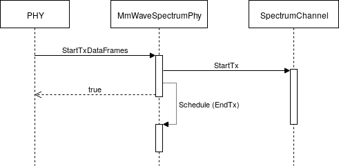
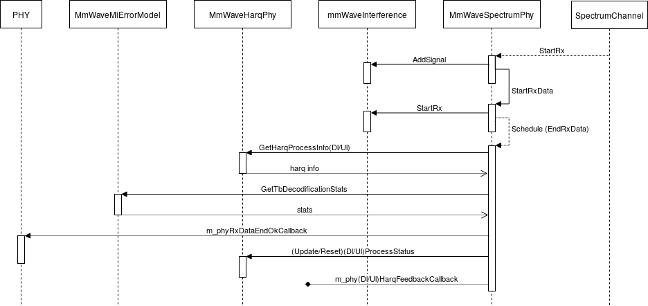

# Module Description

The source code for the new module lives in the directory ``src/mmwave``.
A brief description of the module' classes follows.

  * [MmWaveSpectrumPhy](#mmwavespectrumphy)
    + [Reception of a data signal](#reception-of-a-data-signal)
    + [Reception of a control signal](#reception-of-a-control-signal)
  * [Beamforming Models](#mmwavebeamformingmodel)
    + [MmWaveDftBeamforming](#mmwavedftbeamforming)
    + [MmWaveSvdBeamforming](#mmwavesvdbeamforming)
  * [Error Models](#mmwaveerrormodel)
    + [MmWaveEesmErrorModel](#mmwaveeesmerrormodel)
    + [MmWaveLteMiErrorModel](#mmwaveltemierrormodel)

## MmWaveSpectrumPhy

The class `MmWaveSpectrumPhy` inherits from `SpectrumPhy` and handles the transmission
and reception of signals through the `SpectrumChannel`. Each mmWave device has one
or multiple `MmWaveSpectrumPhy` instances, which are controlled by the PHY layer and
act as interface(s) towards the `SpectrumChannel`(s).

When the current slot is assigned for data or control transmission to a certain
device, its PHY layer triggers the associated `MmWaveSpectrumPhy` instance by
calling the method `StartTxDataFrames ()` or `StartTxDlControlFrames ()`, respectively.
The `MmWaveSpectrumPhy` instance creates the structure
`MmwaveSpectrumSignalParametersDataFrame` or `MmWaveSpectrumSignalParametersDlCtrlFrame`
containing the signal parameters, such as the signal duration, the Power Spectral
Density (PSD) and the information carried, and forwards it to the `SpectrumChannel`
by calling the method `StartTx ()`. This behavior is depicted in this figure:




When a signal is received, the `SpectrumChannel` triggers the `MmWaveSpectrumPhy`
instance by scheduling a call to the method `StartRx ()`.
First, it checks if the signal carries data or control information and then
calls the method `StartRxData ()` or `StartRxCtrl ()`, respectively. If the signal
is neither a mmWave data nor mmWave control signal, or it belongs to another
cell, it is treated as interferer.
The following figure shows the call graph in case of data
reception.




### Reception of a data signal

The method `StartRxData ()` stores the received packets and schedule a call to
`EndRxData ()` after the signal duration.
The method `EndRxData ()` determined if the received transport block is corrupted
or not by applying the error model implemented in the class `MmWaveMiErrorModel`.
If the transport block is not corrupted, it fires the callback `m_phyRxDataEndOkCallback`
to trigger the PHY layer reception operations.
Also, it takes care of updating the corresponding HARQ process status and of
sending the HARQ feedback by relying on the associated `MmWaveHarqPhy` instance.

### Reception of a control signal

The method `StartRxCtrl ()` stores the received packets and schedules a call to
`EndRxCtrl ()` after the signal duration.
The error model is not applied to control messages, then the method `EndRxCtrl ()`
simply fires the callback `m_phyRxCtrlEndOkCallback` to trigger the PHY layer.

## Beamforming Models

`MmWaveBeamformingModel` is a base class handling the beamforming operations.
The classes deriving from `MmWaveBeamformingModel` implement specific beamforming
schemes.
It holds a pointer to an instance of the class `PhasedArrayModel` implementing
the antenna model.
The main method is `SetBeamformingVectorForDevice ()`, which computes the
beamforming vector to communicate with a specific device and configures
the antenna.

### MmWaveDftBeamforming

The class `MmWaveDftBeamforming` implements a DFT-based beamforming algorithm which points the beam in the LOS direction towards the other device. It holds a pointer to the mobility model associated to the device in
order to retrieve its position.
When the method `SetBeamformingVectorForDevice ()` is called, it computes the
beamforming vector using a DFT-based algorithm and properly configures the
antenna weights by calling the method `SetBeamformingVector ()` on the
associated antenna object.

### MmWaveSvdBeamforming

This class implements an ideal beamforming algorithm based on the SVD
decomposition of the channel matrix. The beamforming vectors
are computed using the power method described in [[ZP2017]](#1), Section 5. This is
an ideal method, in the sense that it assumes the perfect knowledge of the
channel matrix.

## Error Models

The class `MmWaveErrorModel` is a base class handling the error model and the PHY layer
abstraction. In particular, all the derived classes implement the computation of the TB BLER,
starting from the SNR calculated by the `MmWaveSpectrumPhy` class. This implementation has been
adapted from the release 1.0 of the 5G-LENA simulator [[5GLENA]](#3) presented in [[LW2020]](#2).

In order to configure the specific `ErrorModel` of choice, the following attributes must be
set to the same value:
``ns3::MmWaveSpectrumPhy::ErrorModelType`` and ``ns3::MmWaveAmc::ErrorModelType``.
Accordingly, a configuration example is:

 ```
Config::SetDefault ("ns3::MmWaveSpectrumPhy::ErrorModelType", TypeIdValue (MmWaveEesmIrT1::GetTypeId ()));
Config::SetDefault ("ns3::MmWaveAmc::ErrorModelType", TypeIdValue (MmWaveEesmIrT1::GetTypeId ()));
 ```

### MmWaveEesmErrorModel

The class `MmWaveEesmErrorModel` implements an Effective Exponential SNR Mapping
(EESM)-based PHY layer abstraction, based on the 3GPP NR specifications.
In particular, LDPC coding and MCS up to 256-QAM are considered.

Different MCS Tables (T1 and T2) and HARQ methods (Incremental Redundancy (IR)
and Chase Combining (CC)) are provided; the corresponding SNR to BLER mappings
are implemented in the specific `MmWaveEesmXXTY` (XX = IR, CC; Y = 1, 2) derived
class.

### MmWaveLteMiErrorModel


The class `MmWaveLteMiErrorModel` implements a Mutual Information (MI)-based PHY layer
abstraction, based on the 3GPP LTE specifications and IR HARQ.

## References

[ZP2020] T. Zugno, M. Polese, N. Patriciello, B. Bojović, S. Lagen, M. Zorzi,
   “Implementation of A Spatial Channel Model for ns-3”, Submitted to the
   Workshop on ns-3 (WNS3 ’20).

[MZ2018] Marco Mezzavilla, Menglei Zhang, Michele Polese, Russell Ford,
   Sourjya Dutta, Sundeep Rangan, Michele Zorzi, “End-to-End Simulation of 5G
   mmWave Networks”, IEEE Communications Surveys and Tutorials. 2018.

[ZP2018] Tommaso Zugno, Michele Polese, and Michele Zorzi. 2018. “Integration of carrier
   aggregation and dual connectivity for the ns-3 mmWave module.”
   In Proceedings of the 10th Workshop on ns-3 (WNS3 '18). ACM, New York, NY,
   USA, 45-52.

<a id="1">[ZP2017]</a>  Menglei Zhang, Michele Polese, Marco Mezzavilla, Sundeep Rangan, and
   Michele Zorzi. 2017. “ns-3 Implementation of the 3GPP MIMO Channel Model for
   Frequency Spectrum above 6 GHz.” In Proceedings of the Workshop on
   ns-3 (WNS3 '17). ACM, New York, NY, USA, 71-78.

[RP2018] M. Rebato, M. Polese, and M. Zorzi, “Multi-Sector and Multi-Panel
   Performance in 5G mmWave Cellular Networks,” in IEEE Global Communications
   Conference: Communication QoS, Reliability and Modeling (Globecom2018 CQRM),
   Abu Dhabi, UAE, Dec 2018

[PM2016] M. Polese, M. Mezzavilla, and M. Zorzi, “Performance Comparison of
   Dual Connectivity and Hard Handover for LTE-5G Tight Integration,” in SIMUTools
   2016

<a id="2">[Lw2020]</a> S. Lagen, K. Wanuga, H. Elkotby, S. Goyal, N. Patriciello and L. Giupponi,
   "New radio physical layer abstraction for system-level simulations of 5G networks."
   in IEEE International Conference on Communications (ICC), Jun 2020

<a id="3">[5GLENA]</a> Please refer to https://5g-lena.cttc.es/ for further details and https://gitlab.com/cttc-lena/nr/-/tree/v1.0 for the reference code.
